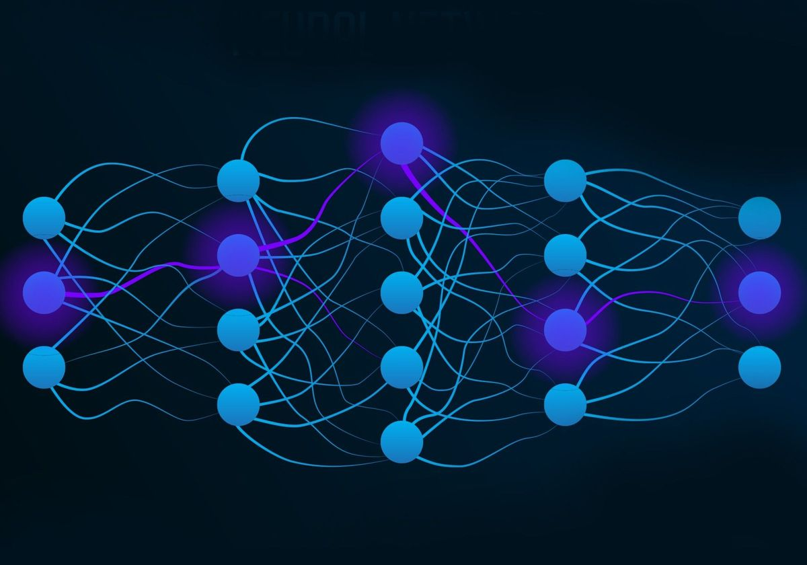

# Deep-Learning Models from Scratch using Numpy

  

## Overview

This project is part of the course "Deep Learning: Architectures & Methods" offered by the Artificial Intelligence and Machine Learning Lab at TU Darmstadt. The repository includes implementations of deep learning models such as feedforward neural networks, recurrent neural networks, autoencoders, and variational autoencoders from scratch using NumPy or PyTorch.

## Task1

- Neural Network using sigmoid activation and squared loss from scratch using NumPy
- Comparison between analytical and numerical gradient computations in the backpropagation
  
## Task2

- Neural network from scratch with NumPy, classification of digits with stochastic gradient descent, evaluating analytical and numerical gradients
  
## Task3

- Neural networks with PyTorch, forward and loss from scratch
  
## Task4

- Feedforward neural networks from scratch using PyTorch
- 
## Task5

- Recurrent neural networks from scratch using PyTorch
  
## Task6

- Autoencoder and Variational Autoencoder from scratch using PyTorch
